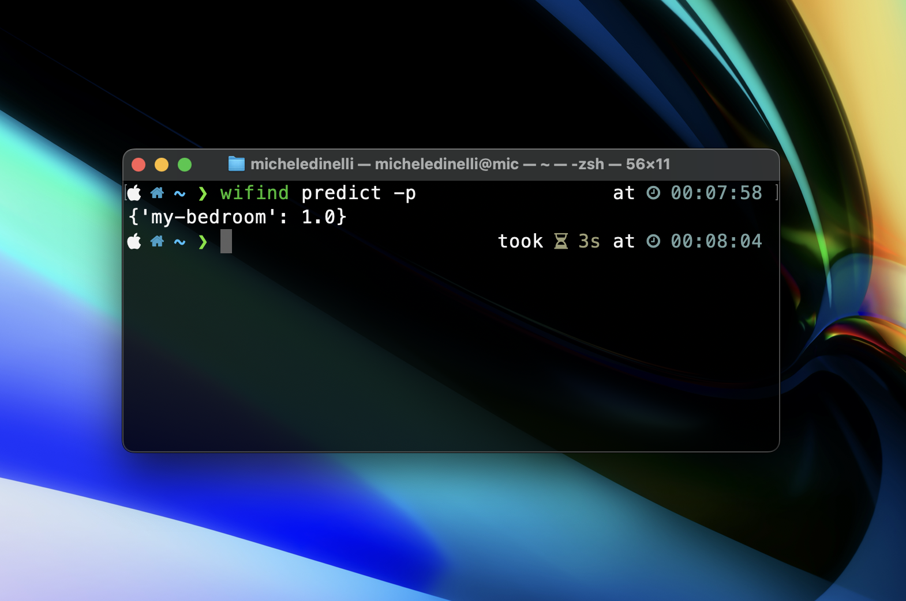

# Welcome to wifind

`Wifind` is cross-platform Command Line Interface (CLI) application that performs radio fingerprinting for indoor localization. 

It's released under `MIT License`.

`Wifind` uses WiFi access points signal strength data to determine where you are.

> WARNING 
> Website is under development

